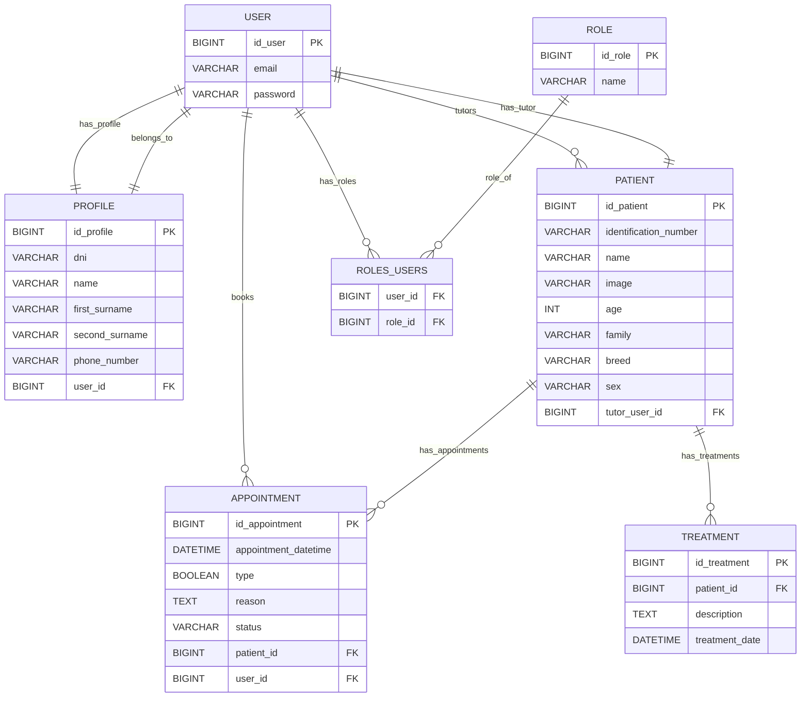
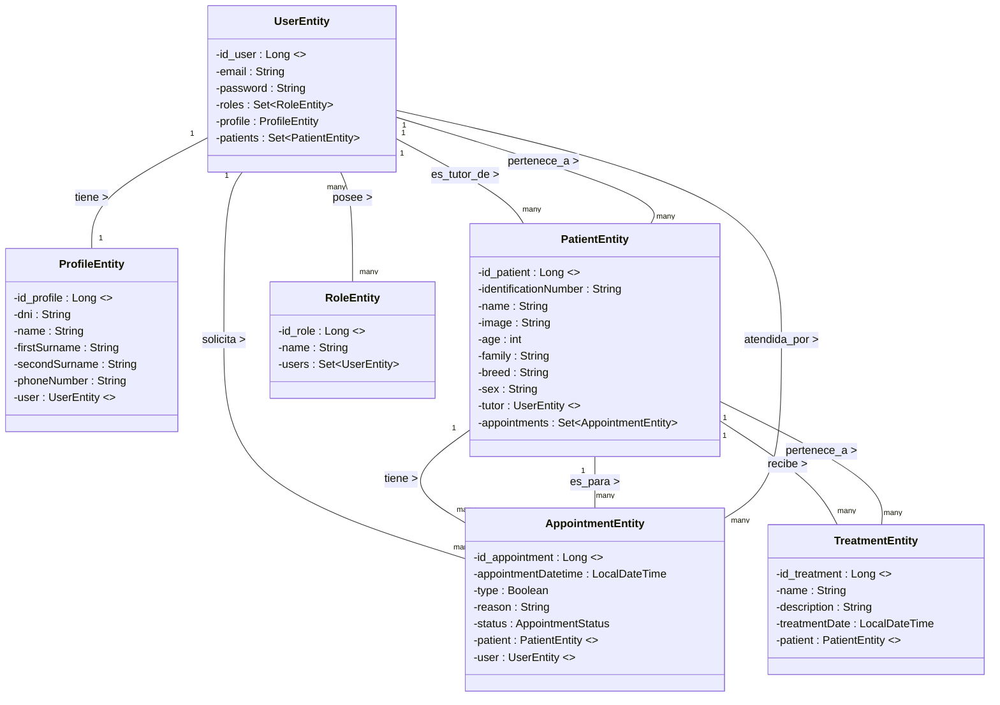

# 🐾 Clínica Veterinaria Margarita - Backend

Sistema de gestión backend para clínica veterinaria especializada en gatos y perros.

## 📋 Descripción

API REST desarrollada con Spring Boot para gestionar clientes, pacientes veterinarios, citas, tratamientos. Incluye sistema de autenticación, área de cliente con citas y mascotas y área de administradora para la veterinaria.

## 🛠️ Tecnologías

- **Java 17+**
- **Spring Boot 3.x**
  - Spring Data JPA
  - Spring Security
  - Spring Validation
  - Spring Mail
  - Spring Scheduler
- **MySQL**
- **BasicAuth**
- **Maven**
- **Postman/Swagger** (Documentación)

## 🗃️ Modelo de Datos

### Diagrama entidad/relación



### Diagrama de clases



## 🔐 Autenticación y Seguridad

### Sistema BasicAuth
- Encriptación de emails y contraseñas
- Roles: `ADMIN` (Margarita) y `USER` (clientes)

### Endpoints Públicos
```
POST /api/v1/register  - Registro de clientes
GET  /api/v1/login     - Inicio de sesión
```

## 📡 API Endpoints

### Postman


## ⚙️ Configuración

### application.properties

```properties
spring.application.name=clinica-veterinaria-back

api-endpoint=/api/v1

spring.profiles.active=devmysql

spring.docker.compose.enabled=true

# Configuración de Email - Gmail
spring.mail.host=smtp.gmail.com
spring.mail.port=587
spring.mail.username=programacionplaceholder@gmail.com
spring.mail.password=awpu xzix puhy fbzc
spring.mail.properties.mail.smtp.auth=true
spring.mail.properties.mail.smtp.starttls.enable=true
```

## 🤖 Tareas Automáticas (Scheduler)

### 1. Actualización de Estado de Citas
```java
@Scheduled(cron = "0 0 0 * * *") // Se ejecuta a las 12:00 AM (medianoche) todos los días
@Transactional
public void markOverduePendingAppointmentsAsPassed()
```
- **Frecuencia**: Diariamente a las 00:00
- **Función**: Cambia citas con estado `PENDIENTE` a `PASADA` si la fecha/hora ya pasó y no fueron marcadas como `ATTENDED`

### 2. Limpieza de Citas Antiguas
```java
@Scheduled(cron = "0 30 0 1 * *") // Se ejecuta a las 12:30 AM el día 1 de cada mes
@Transactional
public void deleteOldPassedAppointments()
```
- **Frecuencia**: Mensual
- **Función**: Elimina automáticamente citas con estado `PASADA` que tienen más de 3 meses de antigüedad

## 📧 Sistema de Notificaciones

### Email de Confirmación de Cita
Se envía automáticamente al crear una nueva cita e incluye:
- Nombre del paciente (mascota)
- Fecha y hora de la cita
- Motivo de la consulta

## 🚦 Validaciones de Negocio

### Límite de Citas Diarias
- **Restricción**: Máximo 10 citas por día
- **Validación**: En tiempo real al crear nueva cita
- **Respuesta**: HTTP 400 Bad Request si se excede el límite

```java
public void validateDailyLimit(LocalDate date) {
    long count = appointmentRepository.countByDate(date);
    if (count >= 10) {
        throw new MaxAppointmentsExceededException(
            "El límite de " + DAILY_APPOINTMENT_LIMIT + " citas diarias ya está completo para el día " + requestedDatetime.toLocalDate()
        );
    }
}
```

## 🚀 Instalación y Ejecución

### Requisitos Previos
- Java JDK 17 o superior
- Maven 3.6+
- MySQL 8.0+ o PostgreSQL
- Git

### Pasos de Instalación

1. **Clonar el repositorio**
```bash
git clone https://github.com/tu-usuario/clinica-veterinaria-backend.git
cd clinica-veterinaria-backend
```

2. **Crear la base de datos**
```sql
CREATE DATABASE clinica_veterinaria;
```

3. **Configurar application.properties**
```bash
# Editar src/main/resources/application.properties
# Configurar credenciales de base de datos y email
```

4. **Compilar el proyecto**
```bash
mvn clean install
```

5. **Ejecutar la aplicación**
```bash
mvn spring-boot:run
```

6. **Verificar que funciona**
```
La API estará disponible en: http://localhost:8080
Documentación Swagger: http://localhost:8080/swagger-ui.html
```

## 🐳 Docker

Se utiliza Docker para la base de datos.

### Ejecutar con Docker
```bash

# Ejecutar con docker-compose
docker compose up

```

## 🧪 Testing

Cobertura de testing


## 📝 Licencia

Este proyecto ha sido desarrollado como ejercicio educativo.

## 👥 Autoría

Desarrollado por Yolanda Alfonso, Lin Carbajales, Iván Lorenzo, Fernanda Marcos, Milca Ponce.


---

**¡Gracias por usar el sistema de gestión de Clínica Veterinaria Margarita! 🐾**
